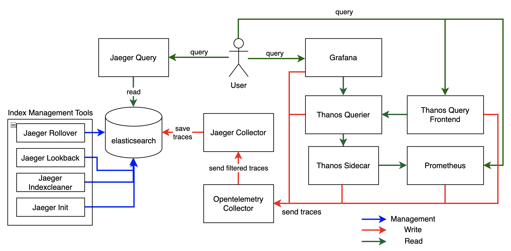
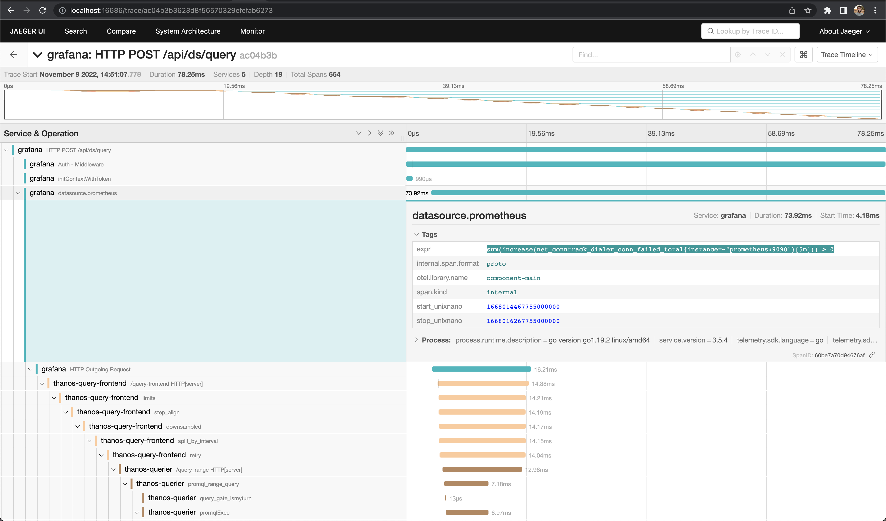

# trace-observability-stack

"Who monitor the monitors?"

Here we create a simple example of how to enable tracing across 
[Grafana](https://grafana.com/) -> [Thanos](https://thanos.io/) -> [Prometheus](https://prometheus.io/) and query it using [Jaeger](https://www.jaegertracing.io/).

Below we describe the architeture built by our docker-compose files.



## Running

First, let's build our local images for index management. These services will provide auto create index (by age for instance)
and delete the old ones (older than some days). Run the command bellow at the root path of this repository:

```shell
sh build-local.sh
```

Now we can start to start up our containers. We create a script to boot them in a specific order. Run the command bellow at the root path of this repository:

```shell
sh up.sh
```

After this, you can open [Grafana](http://localhost:3000), [Thanos Query Frontend](http://localhost:10901), [Prometheus](http://localhost:9090) or [Jaeger](http://localhost:16686), to verify the traces working.

To uninstall the environment you can run the command:
```shell
sh down.sh
```

## Testing

Apply some queries, open some dashboards and then look to Jaeger Query to find the traces of these requests.
