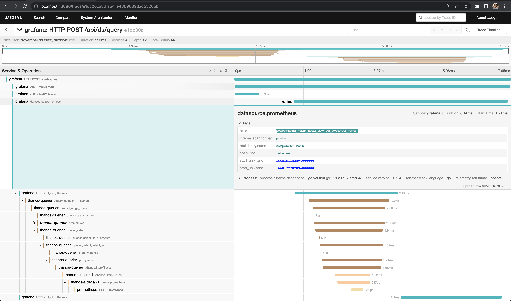

# trace-observability-stack

"Who monitor the monitors?"

Here we create a simple example of how to enable tracing across 
[Grafana](https://grafana.com/) -> [Thanos](https://thanos.io/) -> [Prometheus](https://prometheus.io/) and query it using [Jaeger](https://www.jaegertracing.io/).

Below we describe the architeture built by our [docker-compose](docker-compose.yml).


## Running

Run the command
```shell
docker-compose up
```

And then you can open [Grafana](http://localhost:3000), [Thanos Query Frontend](http://localhost:10901), [Prometheus](http://localhost:9090) or [Jaeger](http://localhost:16686).

Run this command to undeploy
```shell
docker-compose down
```

## Testing

Apply some queries, open some dashboards and then look to Jaeger to find the trace of these requests.
